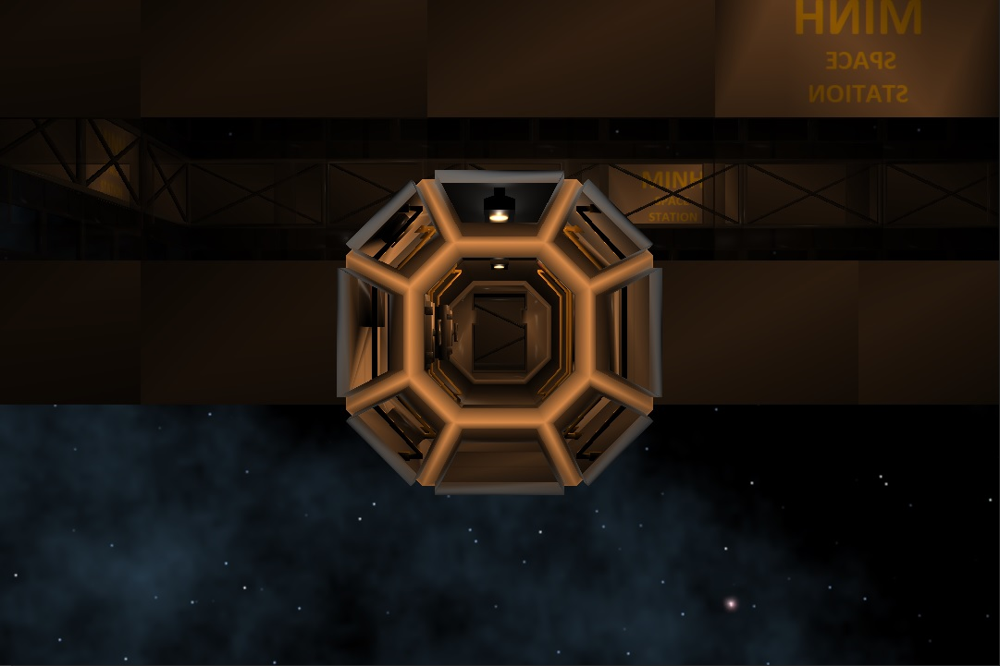
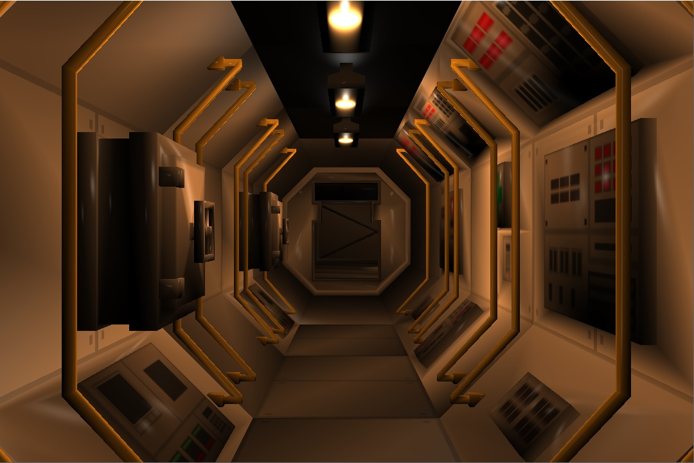
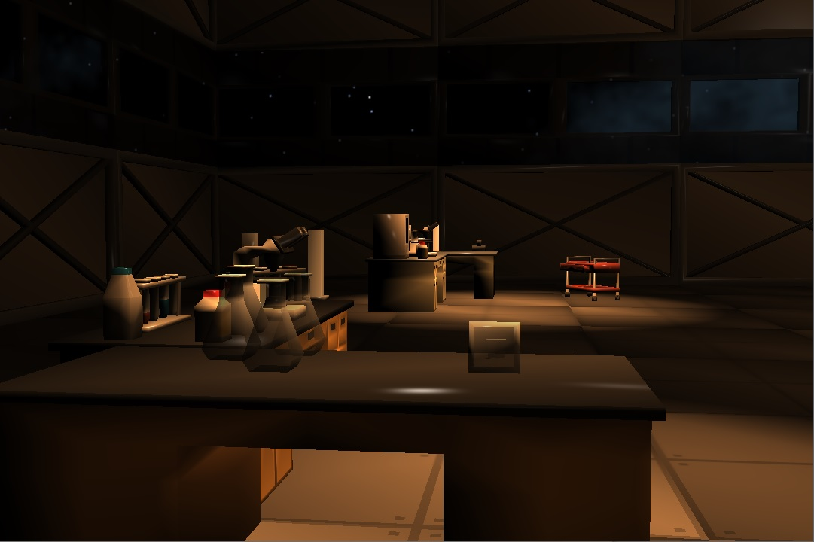
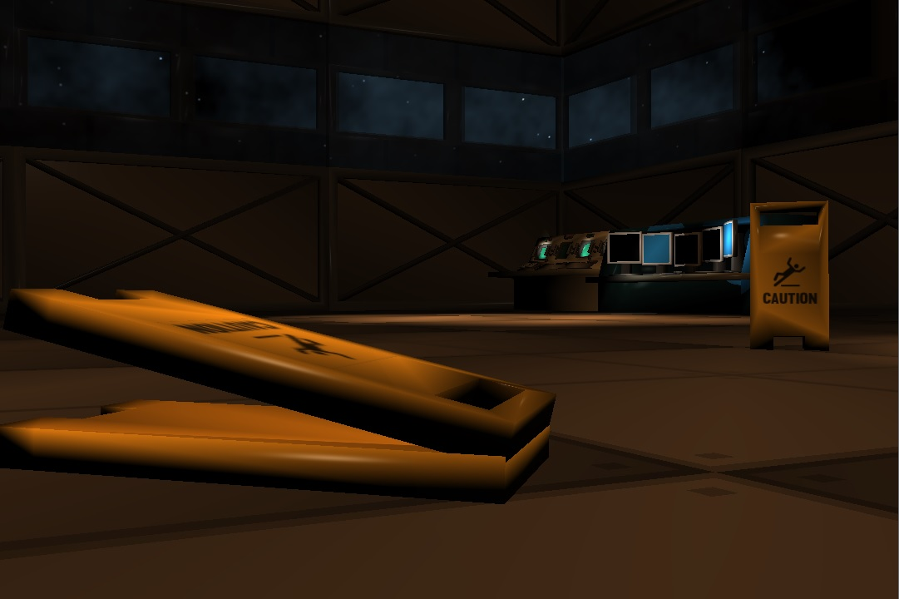
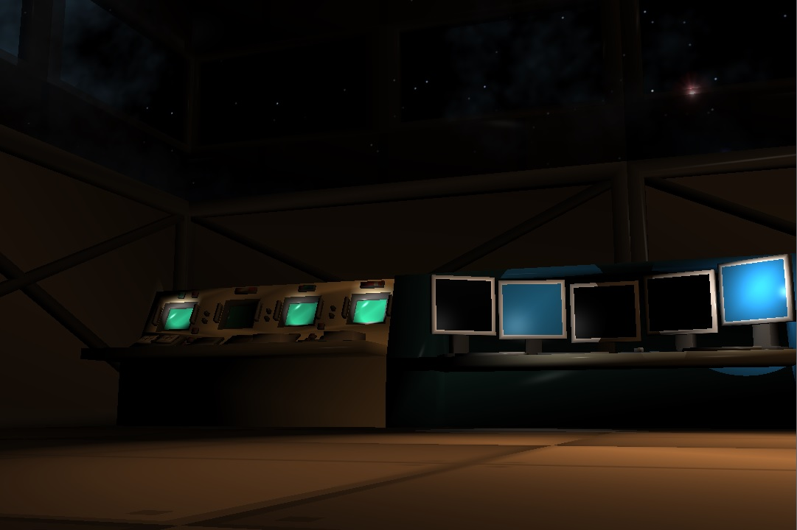
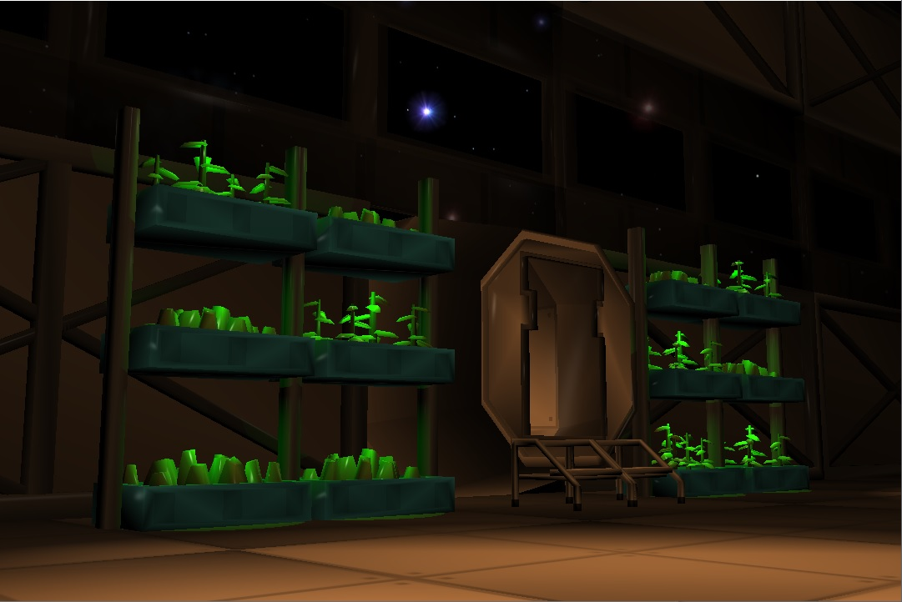
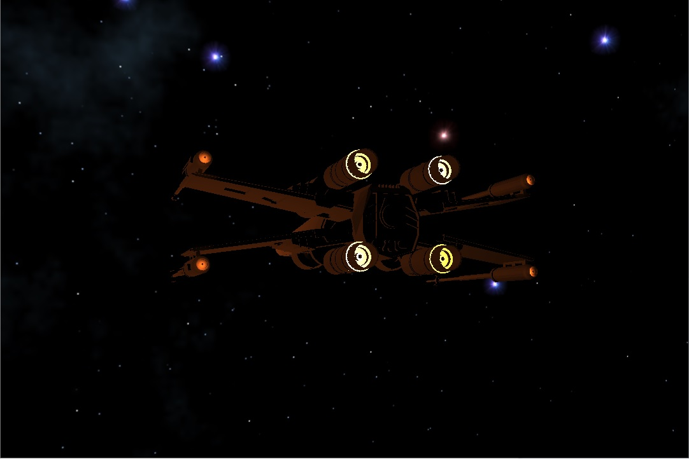
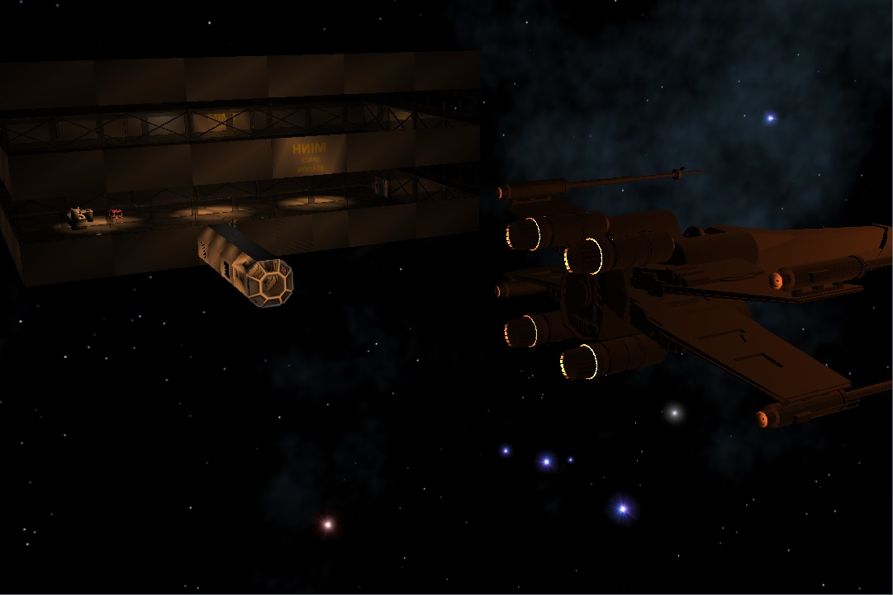

# Static Space Scene - OpenGL

A small C++ program that showcases how to use OpenGL to _create_ a static space scene.    

## Table of Contents
- [Libraries and Tools](#libraries-and-tools)
- [Resource](#resource)
- [Hightlights](#hightlights)
- [Other Information](#other-information)

## Libraries and Tools
- The project is written exclusively in Visual Studio 2019 so there is no `makefile` or `cmake` files.
- OpenGL 4.2+ is required to run some of the OpenGL calls such as `glTexStorage2D` in order to load the skybox.  
- The shaders are written in **OpenGL Shading Language (GLSL)** specifications.
- Libraries that are used in the projects:   
    - [**Glad for OpenGL**](https://glad.dav1d.de/) 0.1.33: OpenGL loader.
    - [**GLFW**](https://www.glfw.org/) 3.3: OpenGL library to create and manage windows and OpenGL contexts.
    - [**GLM**](https://glm.g-truc.net/0.9.9/index.html) 0.9.9: Math library for OpenGL.   
    > **Note**: All of the libraries above are already included in the project.

## Resource
- The models are mostly from [Simple Space Interiors asset pack](https://assetstore.unity.com/packages/3d/environments/sci-fi/simple-space-interiors-cartoon-assets-87964).    
- All of the models are formatted as raw `.ply`s (not binary) with specified properties as follows:  
    - RGBA is from 0 to 255.   
    ```
    property float x
    property float y
    property float z
    property float nx
    property float ny
    property float nz
    property uchar red
    property uchar green
    property uchar blue
    property uchar alpha
    property float texture_u
    property float texture_v
    ```
- List of the models (`.fly` files) that are used:                                                            
    - ISO_Sphere_Smooth_inverted_normals                
    - ISO_Shphere_flat_4div                                                                                   
    - SM_Env_Ceiling_Light_02                           
    - SM_Env_Construction_Wall_01                       
    - SM_Env_Construction_Wall_02                       
    - SM_Env_ControlRoom_Window_01                  
    - SM_Env_Door_01                                    
    - SM_Env_Floor_01                                   
    - SM_Env_Floor_04                                   
    - SM_Env_Transition_Door_Curved_01                  
    - SM_Env_Wall_Curved_01                             
    - SM_Env_Wall_Curved_02                             
    - SM_Env_Wall_Curved_03                             
    - SM_Env_Wall_Curved_04                             
    - SM_Env_Wall_Curved_05                             
    - SM_Env_Window_End                                 
    - SM_Prop_Beaker_01                                 
    - SM_Prop_Cart_01                                   
    - SM_Prop_ControlDesk_01                            
    - SM_Prop_ControlDesk_Vintage_01                    
    - SM_Prop_Desk_01                                   
    - SM_Prop_Desk_02                                   
    - SM_Prop_Desk_Lab_01                               
    - SM_Prop_Desk_Lab_02                               
    - SM_Prop_Lockers_01                                
    - SM_Prop_Lockers_04                                
    - SM_Prop_Lockers_05                                
    - SM_Prop_Phone_01                                  
    - SM_Prop_Plants_05                                 
    - SM_Prop_Plants_06                                 
    - SM_Prop_Scales_01                                 
    - SM_Prop_Sign_01                                   
    - SM_Prop_StepLadder_01                             
    - X-Wing_Attack                                     
    > All of the models (`.ply` files) should be placed in `src/OpenGLProject/assets/models/`
- **SpaceInteriors Texture**, which comes along with the model pack, and skybox textures must be formatted as 24bit-bitmap image in order to load into the program.   
    > The models' texture should be placed in `src/OpenGLProject/assets/textures/`   
    > The skybox's texture should be placed in `src/OpenGLProject/assets/textures/space_sky_box/`

>**Note**: All of the models and textures, which are used in the project, are **NOT** included.    

## Hightlights
> Short video demo can be found at https://youtu.be/mwWT0cJzcBE

- Sky is rotating.       



- Objects are shiny.



- The beakers (laboratory equipment) on the near table are transparent.   



- Same object but different angles and lights.



- Directional lights are used to replicate a working computer screen.



- Directional lights with customized color.



- Changing light attenuation to replicate flickering engine light.



- Overview of the space



## Other Information
- The project is the final product of INFO3111 course.
- The [**Fly Camera**](./fly_camera) module is added in order to navigate through the scene easier.
- The [**Texture Manager**](./cBasicTextureManager) module is added in order to be able to wrap the object with realistic costume.   
> **Note**: These two modules, **Fly Camera** and **Texture Manager**, are written by [**Professor Michael Feeney**](https://github.com/LordMichaelmort) and are used without any modification.
